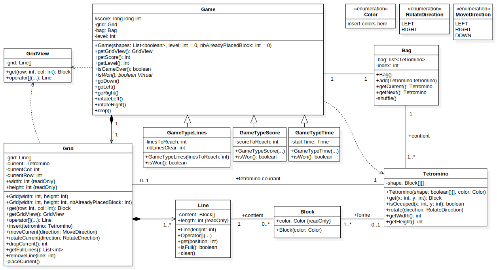

# Modélisation Métier

Ce répertoire contient la modélisation métier de notre projet Tetris.

## Modèle

Le modèle au format starUML est disponible dans le fichier [tetris.mdj](./tetris.mdj) et une analyse textuelle, en lien avec ce dernier, dans le fichier [Projet DEV4 - Rapport Analyse 60453 60073.pdf](./Projet%20DEV4%20-%20Rapport%20Analyse%2060453%2060073.pdf).

Ci-dessous, une image du modèle réalisé

